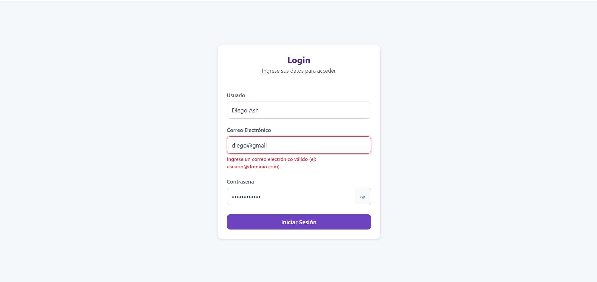
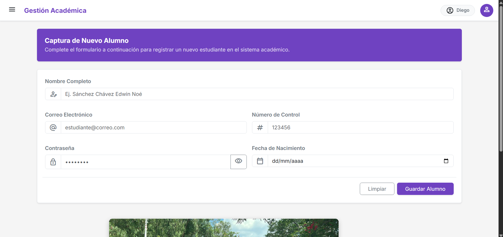
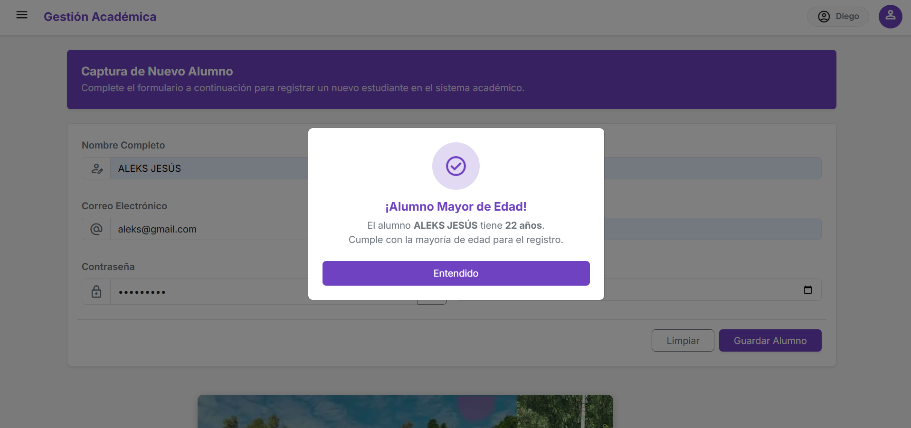

<div align="center">

# Actividad 5. Proyecto de Login
---


---

**Instituto Tecnológico Nacional de México - Instituto Tecnológico de Oaxaca**

| | |
|---|---|
| **Carrera** | Ingeniería en Sistemas Computacionales |
| **Materia** | Programación Web |
| **Docente** | Adelina Martínez Nieto |
| **Actividad** | Actividad 5. Proyecto de Login |
| **Integrantes** | Sánchez Hernández Diego Alonso <br>Sánchez Chávez Edwin Noé  |
| **Fecha de entrega** | 08 de julio del 2026 |

[](https://github.com/diegooash)
[](https://github.com/noeEdwin)
[](https://noeedwin.github.io/Login-ProgramacionWeb/login.html)

</div>

---

## Descripción del proyecto

Este proyecto consiste en la creación de un sistema web funcional y responsivo dividido en dos pantallas interconectadas: una **pantalla de acceso (Login)** y un **panel administrativo** enfocado en la captura de alumnos. 

Está construido completamente con **HTML5, CSS3 y JavaScript puro (Vanilla JS)**, integrando **Bootstrap 5.3.3** como framework base para el diseño visual y la adaptabilidad móvil. Además, implementa un control de validaciones de formularios apoyado en una librería externa de utilería (`utileria.js` realizada con aterioridad en clase) y gestiona la persistencia de datos y sesiones a través del almacenamiento local del navegador (`localStorage`).

---

## Flujo del sistema y arquitectura

El sistema no se concentra en una sola página, sino que simula el flujo real de una aplicación web dividida en las siguientes vistas:

| Página | Descripción |
|--------|-------------|
| **Login (`login.html`)** | Pantalla de acceso con formularios validados. Permite al usuario identificarse. Al superar la validación, guarda la sesión y redirige automáticamente al sistema principal. |
| **Sistema principal (`index.html`)** | Pantalla interna del sistema con barra superior (**Navbar**), menú lateral retráctil (**Sidebar**), submenús desplegables y un formulario completo para la captura y registro de estudiantes con cálculo de edad. |

### Estructura del repositorio

```text

Login-ProgramacionWeb/
├── README.md              # Documentación técnica y proceso de creación
├── index.html             # Pantalla 2: Panel administrativo principal
├── login.html             # Pantalla 1: Acceso al sistema
├── css/
│   ├── index.css          # Estilos para el dashboard, sidebar y animaciones
│   └── login.css          # Estilos e identidad visual para el acceso
├── img/
│   ├── index.png          # Captura de pantalla dentro del sistema
│   ├── ito.jpeg           # Imagen de la institucion
│   ├── ito2.jpeg          # Imagen institucional secundaria
│   ├── ito3.jpeg          # Imagen institucional terciaria
│   ├── modal.png          # Captura del modal de verificación de edad
│   └── modulo_login.png   # Captura de pantalla de la interfaz de login
└── js/
    ├── index.js           # Lógica del sidebar, modal y cálculo de edades
    ├── login.js           # Lógica de autenticación simulada y localStorage
    └── utileria.js        # Librería de validaciones y formateo (proporcionada)

```

---

## Documentación técnica

### 1. Framework CSS utilizado

Se utilizó **Bootstrap 5.3.3 via CDN** como base estructural. Se complementó con hojas de estilo personalizadas (`login.css` e `index.css`) para definir una paleta de colores propia, bordes suaves, sombras y tipografías externas y los iconos de *Material Symbols*.

### 2. ¿Cómo fluye el Login hacia el Sistema?

El acceso se simula en el lado del cliente. Cuando el usuario intenta iniciar sesión en `login.html`:

1. El script `login.js` intercepta el envío del formulario (`e.preventDefault()`).
2. Se procesan los datos limpiando espacios y aplicando formato de nombre propio (con las funciones propias de la libreria que creamos anteriormente).
3. Se ejecutan las validaciones. Si todo es correcto, se almacena el usuario en el navegador mediante `localStorage.setItem('usuarioActual', usuario)`.
4. Finalmente, se redirige al panel con `window.location.href = 'index.html'`.

### 3. ¿Cómo se pasa el nombre de usuario al Navbar?

Para que el sistema mantenga la continuidad, se aprovecha la persistencia de datos en el navegador:

* Al cargarse `index.html`, el script de `index.js` ejecuta un bloque de seguridad que verifica la existencia de la sesión con `localStorage.getItem("usuarioActual")`.
* Si el dato existe, reemplaza el texto por defecto del elemento `#navUsuario` (en escritorio) y `#navUsuarioMovil` (en móvil) con el nombre del administrador logueado.
* Si el dato **no existe** (el usuario intentó entrar directamente a la URL de `index.html`), el sistema lo bloquea y lo redirige automáticamente al login.
* Al presionar la opción **"Salir del sistema"** en el dropdown, se ejecuta un `localStorage.removeItem("usuarioActual")` y se devuelve al usuario a `login.html`.

### 4. Métodos principales de utilería y lógica

| Método | Archivo | Función |
| --- | --- | --- |
| `validarCorreo(correo)` | `utileria.js` | Evalúa mediante expresiones regulares que el string tenga un formato de correo válido (`usuario@dominio.mx`). |
| `validarPassword(pass)` | `utileria.js` | Asegura que la contraseña tenga mín. 8 caracteres, mayúsculas, minúsculas, números y al menos un carácter especial. |
| `soloLetras(texto)` | `utileria.js` | Valida que los campos de nombre solo contengan caracteres alfabéticos y espacios. |
| `limpiarEspacios()` | `utileria.js` | Elimina espacios dobles accidentales al inicio, final y centro de las cadenas. |
| `formatearNombrePropio()` | `utileria.js` | Capitaliza automáticamente la primera letra de cada palabra del nombre ingresado. |
| `validarNumeroControl()` | `utileria.js` | Verifica que el número de control del alumno conste exacta y estrictamente de 6 dígitos numéricos (`^\d{6}$`). |
| `calcularEdad(fecha)` | `utileria.js` | Retorna la edad exacta en años cumplidos restando la fecha actual de la fecha de nacimiento ingresada. |
| `esMayorDeEdad(fecha)` | `utileria.js` | Retorna un valor booleano (`true`/`false`) si la persona tiene 18 años o más. |
| `mostrarError(campo, msg)` | `utileria.js` | Inyecta mensajes de error dinámicos en el DOM y resalta los bordes de los inputs en rojo (`.input-error`). |

---

## Proceso de creación paso a paso

### Paso 1: Configuración Inicial y Repositorio

Se creó un repositorio público en GitHub, se integró la librería proporcionada `utileria.js` y se establecieron los nombres para archivos HTML, CSS y JS, segun las indicaciones dadas por la docente.

### Paso 2: Construcción del módulo de Acceso (`login.html`)


*Figura 1: Modulo de inicio de sesión.*

* Se maquetó una tarjeta centrada con diseño moderno y colores institucionales.
* Se agregó un botón interactivo de visibilidad de contraseña (icono de ojo) que alterna dinámicamente el atributo `type` entre `password` y `text`.
* Se implementaron mensajes de retroalimentación visual debajo de cada campo con la etiqueta `<small class="error-message">`.

### Paso 3: Maquetado del Panel Principal (`index.html`) 


*Figura 2: Modulo del sistema.*

* Se construyó la estructura con un **TopNavBar** fijo que alberga el nombre de usuario y el menú desplegable de cierre de sesión.
* Se diseñó un **SideNavBar** (menú lateral) con botón hamburguesa para apertura/cierre responsivo en móviles y un submenú tipo acordeón en la sección **Usuarios -> Captura**.
* Se armó la tarjeta principal con el formulario de **Captura de Alumnos**, incluyendo campos para Nombre, Correo, Número de Control (con longitud máxima de 6 dígitos) y Fecha de Nacimiento.

### Paso 4: Lógica e Integración de Validaciones

Se programaron las validaciones en ambos scripts para interceptar los eventos `submit`. Se conectaron las alertas visuales para que, en caso de error en cualquier campo, se detenga el envío, se enfoque el input en rojo y se muestre el texto descriptivo del error.

### Paso 5: Implementación del Modal de Verificación de Edad


*Figura 3: Modal con los datos procesados.*

En el panel de alumnos, se conectó el botón de "Guardar Alumno" al cálculo de fechas de la utilería. Al enviarse el formulario sin errores, el script evalúa la edad:

* Si `esMayorDeEdad()` es verdadero, invoca un **Modal de Bootstrap** con diseño de éxito (verde), ícono de aprobación y un mensaje confirmando la mayoría de edad.
* Si es menor de edad, el modal adapta sus estilos visuales a modo de advertencia (amarillo) e informa que el estudiante requerirá carta responsiva.

---

##  Como ejecutar en local

1. Clonar este repositorio en tu máquina local:

```bash
git clone [https://github.com/noeEdwin/Login-ProgramacionWeb.git](https://github.com/noeEdwin/Login-ProgramacionWeb.git)

```


2. Entrar a la carpeta del proyecto:

```bash
cd Login-ProgramacionWeb

```


3. Abrir el archivo `login.html` directamente en tu navegador web de preferencia (Chrome, Edge, Firefox).

---

## Demo en Vivo (GitHub Pages)

El flujo completo del sistema (Login → Sistema → Modal de Alumnos → Cerrar Sesión) se encuentra implementado y funcionando en el siguiente enlace oficial:

**[Ver Sistema en Vivo - GitHub Pages](https://noeedwin.github.io/Login-ProgramacionWeb/login.html)**

---

```